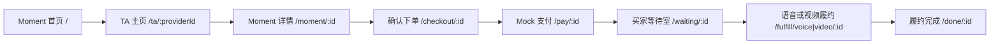
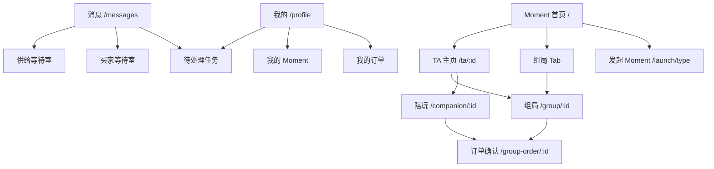

# MAXU Moment Demo — 主流程图

> **UI 开稿请先看 [UI_PRODUCT_SPEC.md](./UI_PRODUCT_SPEC.md)**（分屏规格、文案、规则）。  
> 屏清单索引见 [WIREFRAMES_HANDOFF.md](./WIREFRAMES_HANDOFF.md)。

| 资源 | URL |
|------|-----|
| **Live Demo** | https://www.up9.life/ |

---

## 图 A — 买家 1V1（P0）

全程 **Tab 隐藏**（等待室 → 履约 → 完成）。

| 步骤 | 路由 | Tab |
|------|------|-----|
| Moment 首页 | `/` | 显示 |
| TA 主页 | `/ta/:providerId` | 显示 |
| Moment 详情 | `/moment/:id` | 显示 |
| 确认下单 | `/checkout/:id` | 显示 |
| Mock 支付 | `/pay/:id` | 显示 |
| 买家等待室 | `/waiting/:id` | **隐藏** |
| 履约 | `/fulfill/voice/:id` 或 `/fulfill/video/:id` | **隐藏** |
| 完成 | `/done/:id` | **隐藏** |

**分支**：远档待确认 `/pending-accept/:id`（Tab 隐藏，demo 默认不触发）· 订单入口 `/profile/orders`

---

## 图 B — 供给侧：发起 + 履约（P0）

```mermaid
flowchart LR
  MyMoments["我的 Moment /profile/my-moments"] --> LaunchType["选择 SKU /launch/type"]
  LaunchType --> LaunchProduct["商品定价 /launch/product"]
  LaunchProduct --> LaunchFulfill["履约设置 /launch/fulfillment"]
  LaunchFulfill --> LaunchPreview["确认发布 /launch/preview"]
  LaunchPreview --> LaunchSuccess["发布成功 /launch/success/:id"]
  LaunchSuccess --> Tasks["待处理任务 /profile/my-moments/tasks"]
  Tasks --> SupplyWait["供给等待室 /supply/waiting/:id"]
  SupplyWait --> SupplyFulfill["供给履约 /supply/fulfill/voice|video/:id"]
  SupplyFulfill --> Tasks
```

| 区段 | Tab | 说明 |
|------|-----|------|
| 发起 4 步 `/launch/type`–`/launch/preview` | **隐藏** | 发布成功页 Tab **显示** |
| 我的 Moment / 任务页 | 显示 | 任务页只有「进入等待室」，无「标记就绪」 |
| 供给等待室 / 供给履约 | **显示** | 与买家等待室不同 |

---

## 图 C — 侧路入口（P1）

---

## Tab 显隐速查

依据 `src/components/AppShell.tsx`：

| 路径前缀 | Tab |
|----------|-----|
| 默认（含 `/supply/waiting`、`/supply/fulfill`、`/moment/:id`） | **显示** |
| `/waiting*` | **隐藏** |
| `/fulfill*`（买家路径） | **隐藏** |
| `/done*` | **隐藏** |
| `/pending-accept*` | **隐藏** |
| `/profile/my-moments/launch/type`–`preview` | **隐藏** |

底部 Tab：**主页 · 消息 · Moment · 我的**，右侧 **+** 发布。

---

## 关键规则（详见主文档 §4）

1. **标记就绪 / 我已就位**：仅在等待室内；任务页不进等待室不能标记  
2. **提前开始**：双方就绪 → 可提前开始履约；到点仍可兜底  
3. **Demo 联调**：单方点就绪模拟双方就绪（`DEMO_MIRROR_READY`）  
4. **双角色路由**：买家/供给自动跳转对应 waiting、fulfill 路径  
5. **供给履约结束**：回 **待处理任务**，不走买家完成页
